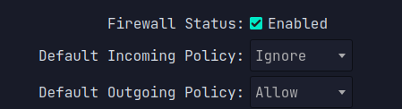

# "Шорткат" для терминала

## Для KDE

Открываем настройки и переходим в Shortcuts.

<figure><figcaption>
Вкладка Shortcuts
</figcaption></figure>

Нажимаем "**Add Application**" и ищем наш терминальный эмулятор. Затем нажимаем на Custom Shortcuts и когда появится надпись "**Input...**" нажимаем нужный нам "шорткат".

## Для GNOME

Открываем настройки и переходим в _**Keyboard**_.&#x20;

<figure><figcaption>
<a href="https://www.youtube.com/@PLAFON20">Автор скриншота - Plafon</a>
</figcaption></figure>

Задаем имя нашего терминального эмулятора, команду с помощью которой открывается терминальный эмулятор(для меня эта команда kitty), а также сам "шорткат".


Принятый стандарт - это Ctrl+Alt+T.&#x20;

