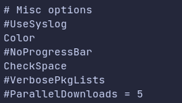

# Snap

<figure><figcaption><p><a href="https://snapcraft.io/store">Snapcraft.io</a></p></figcaption></figure>


_**Snap**_ — это приложения, упакованные со всеми их зависимостями для запуска во всех популярных дистрибутивах Linux из одной сборки. Они обновляются автоматически и изящно откатываются.



Если вы выбираете между _**Snap**_ и _**Flathub**_, то лучше выбрать _**Flathub**_.


Чтобы установить Snap введите следующие команды.

```shell
cd ~/Downloads
git clone https://aur.archlinux.org/snapd.git
cd snapd
makepkg -si
```

Далее надо настроить демона _**snapd**_.

```shell
sudo systemctl enable --now snapd.socket
sudo ln -s /var/lib/snapd/snap /snap
systemctl enable --now snapd.apparmor
sudo reboot
```

## Команды

Чтобы установить программу.

```shell
snap install название_пакета
```

Чтобы удалить программу.

```shell
snap remove название_пакета
```

Чтобы  посмотреть список установленных пакетов.

```shell
snap list
```

Чтобы найти тот или иной пакет.

```shell
snap find название_пакета
```
