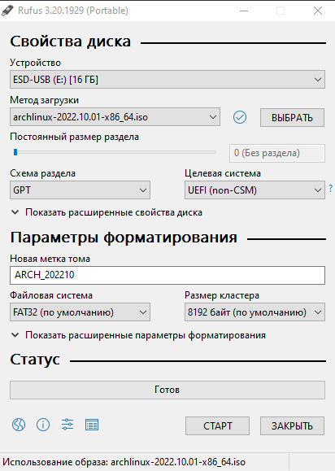

# Pre-setup

## Windows Configuration
1. Disable `Fast boot`.
2. Set the univertal UTC time.
- Open `REGEDIT` and find `HKEY_LOCAL_MACHINE\SYSTEM\CurrentControlSet\Control\TimeZoneInformation\`.
- Create a `QWORD` with name `RealTimeIsUniversal` and with value `1`.
- Open time and date settings, disable `Set time automatically` and `Set timezone automatically`.
- Re-enable those settings again.

## Download Arch Linux with Dualboot
1. Download [Torrent file](https://archlinux.org/releng/releases/).
2. Install .iso with Rufus(With `GPT`):

3. Reboot `Windows` and open `Boot Menu`.

## Next...
Chapter 2: [`Base Arch installation`](./arch_install.md).